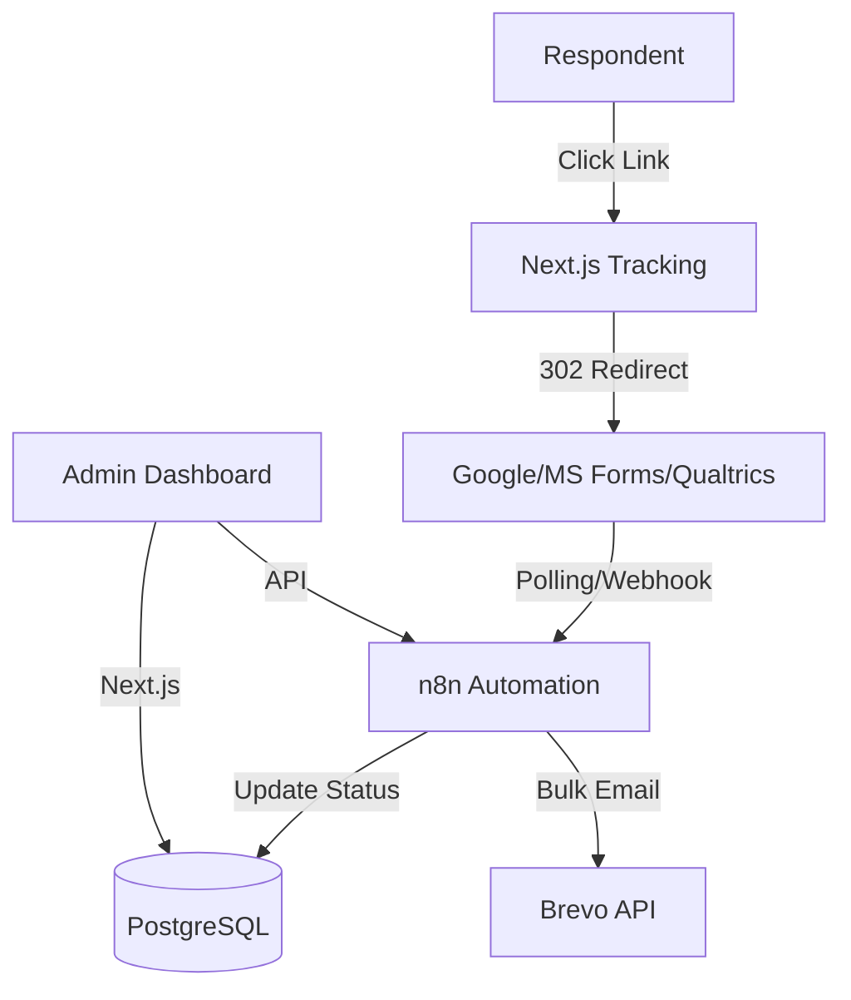

# Survey Automation Platform

> A self-hosted research survey management system that handles respondent tracking, unique link generation, and automated reminders at scale.

[](https://github.com/your-org/survey-automation/actions)
[](LICENSE)

## 🎯 Why This Exists

Traditional survey platforms like Google Forms or MS Forms are excellent for data collection but lack robust respondent tracking and automated follow-up for large-scale research. This platform bridges that gap by managing the "pre-survey" and "follow-up" phases, while allowing you to keep using the form providers you already trust.

### Key Capabilities

- **Unique Tracking Links**: Generate secure, personalized links for each respondent.
- **Provider Agnostic**: Use Google Forms, MS Forms, or Qualtrics for the actual survey.
- **Automated Reminders**: n8n-powered smart reminders that stop automatically once a survey is completed.
- **Event-Driven Tracking**: Log email opens, link clicks, and survey completions in real-time.
- **Self-Hosted Privacy**: Full control over your respondent data on your own VPS.

## 🏗️ Architecture



For a deeper dive into the system design, see [DESIGN.md](DESIGN.md).

## 🚀 Quick Start (Production)

1.  **Prerequisites**: A Linux VPS with Docker and a domain name.
2.  **Clone & Configure**:
    ```bash
    git clone https://github.com/your-org/survey-automation.git
    cd survey-automation
    cp .env.example .env
    # Edit .env with your domain and secrets
    ```
3.  **Deploy**:
    ```bash
    ./deploy.sh
    ```
4.  **Access**:
    - **Dashboard**: `https://yourdomain.com`
    - **n8n**: `https://yourdomain.com/n8n/`

## 📚 Documentation Index

- [**API Reference**](docs/API_REFERENCE.md) - Documentation for all Next.js and Webhook endpoints.
- [**Workflow Tutorials**](docs/WORKFLOW_TUTORIALS.md) - How to import and configure the n8n automation flows.
- [**Deployment Guide**](docs/DEPLOYMENT_GUIDE.md) - Detailed production setup, reverse proxy, and SSL.
- [**Test & Dev Guide**](docs/TEST_GUIDE.md) - Local development, migrations, and testing suite.

## 🛠️ Tech Stack

- **Frontend/Backend**: Next.js 16 (TypeScript, App Router)
- **Database**: PostgreSQL 16
- **Automation**: n8n (Self-hosted)
- **Email**: Brevo (SMTP + API)
- **Reverse Proxy**: Caddy (Auto-HTTPS)
- **Infrastructure**: Docker Compose

## 🤝 Contributing

We welcome contributions! Please see our [Contributing Guide](CONTRIBUTING.md) and [Test Guide](docs/TEST_GUIDE.md) to get started.

## 📄 License

MIT © Research Automation Team
