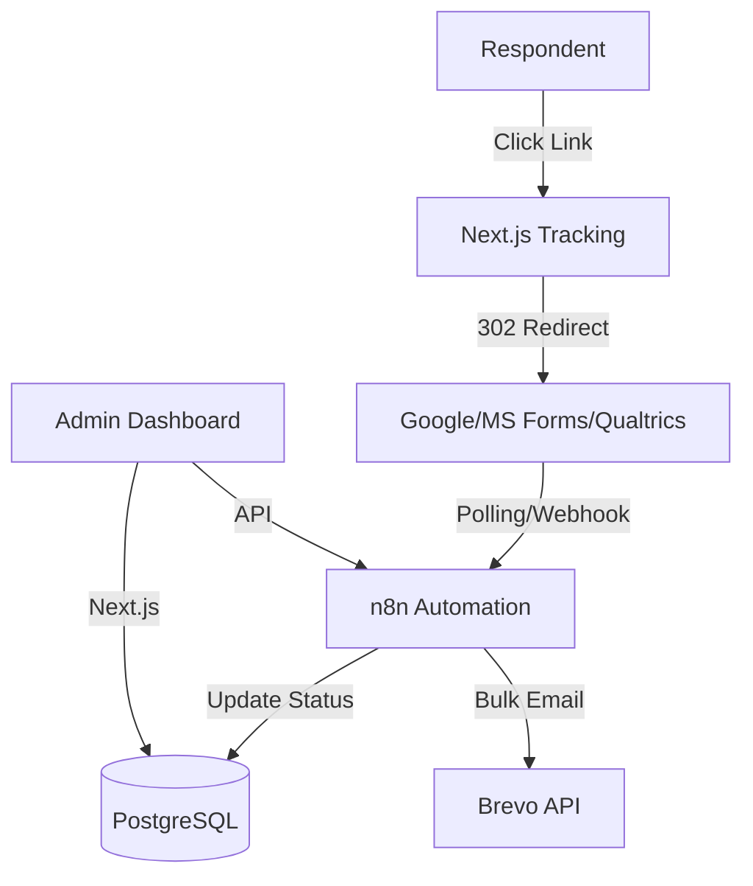

# Survey Automation Platform

A secure, self-hosted survey orchestration platform designed for high-throughput respondent tracking, personalized link delivery, and automated reminder workflows.

[](https://github.com/your-org/survey-automation/actions)
[](LICENSE)

## 📋 Overview

Modern survey tools (such as Google Forms, Microsoft Forms, and Qualtrics) are excellent for data collection but lack built-in capabilities for tracking individual respondents, generating secure personalized links, and managing automated follow-ups. 

The Survey Automation Platform bridges this gap. It acts as an orchestration layer that handles the pre-survey delivery and post-survey reminder phases, allowing organizations to maintain full control of respondent metadata while continuing to leverage their preferred external form engines.

### Key Capabilities

- **Personalized Link Generation**: Generate secure, encrypted tracking links unique to each respondent to monitor participation status.
- **Provider Agnostic**: Connects seamlessly with external form engines (Google Forms, MS Forms, Qualtrics, etc.).
- **Automated Reminder Engine**: n8n-powered workflow automation that triggers smart reminders and automatically halts notifications once a survey is submitted.
- **Event-Driven Auditing**: Real-time logging of transactional email dispatches, email opens, link clicks, and survey completions.
- **Data Privacy & Compliance**: Fully self-hosted architecture ensuring that respondent PII (Personally Identifiable Information) never leaves your infrastructure.

## 🏗️ Architecture



Detailed system design and technical specifications are documented in [DESIGN.md](DESIGN.md).

## 🚀 Deployment & Setup

### Prerequisites
- A virtual private server (VPS) running Linux
- Docker and Docker Compose installed
- A registered domain name pointing to your server's IP address

### Installation

1. Clone the repository and configure the environment:
   ```bash
   git clone https://github.com/your-org/survey-automation.git
   cd survey-automation
   cp .env.example .env
   ```
2. Edit the `.env` file to configure your host domain, databases, and SMTP/API keys.
3. Deploy the containers:
   ```bash
   ./deploy.sh
   ```

Once deployed, the platform components will be accessible at:
- **Admin Dashboard**: `https://<your-domain>`
- **n8n Workflow Editor**: `https://<your-domain>/n8n/`

## 📚 Documentation

- [**API Specification**](docs/API_REFERENCE.md) - Details on Next.js endpoints, webhooks, and tracking routes.
- [**Workflow Configuration**](docs/WORKFLOW_TUTORIALS.md) - Step-by-step guides for importing and configuring n8n templates.
- [**Deployment Guide**](docs/DEPLOYMENT_GUIDE.md) - Deep dive into production setup, SSL certificates, and proxy configurations.
- [**Development & Testing**](docs/TEST_GUIDE.md) - Guidelines for local development, database migrations, and unit tests.

## 🛠️ Technology Stack

- **Core Application**: Next.js 16 (TypeScript, App Router)
- **Database**: PostgreSQL 16
- **Workflow Engine**: n8n (Self-hosted)
- **Email Delivery**: SMTP / Brevo API Integration
- **Reverse Proxy / SSL**: Caddy
- **Containerization**: Docker Compose

## 🤝 Contributing

We welcome contributions to the Survey Automation Platform. Please see our [Development & Testing](docs/TEST_GUIDE.md) guidelines to get started.

## 📄 License

This project is licensed under the MIT License. See the [LICENSE](LICENSE) file for details.
